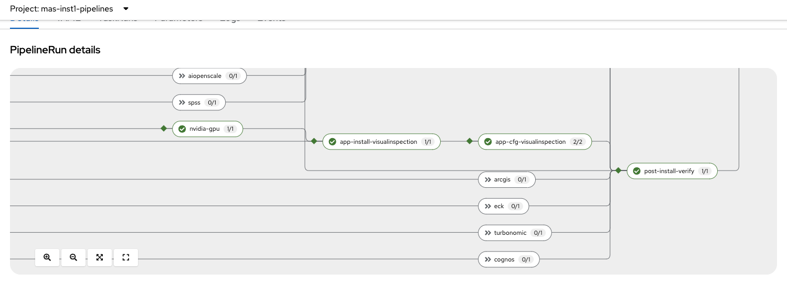
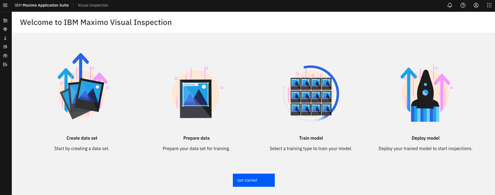
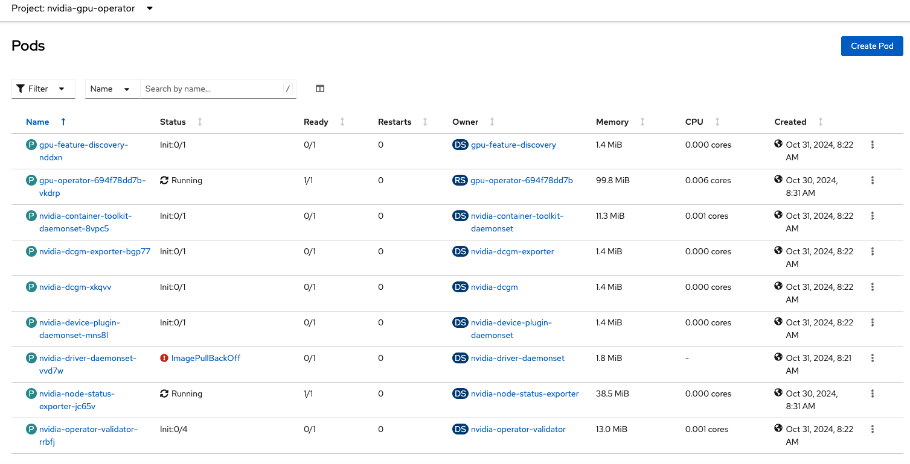
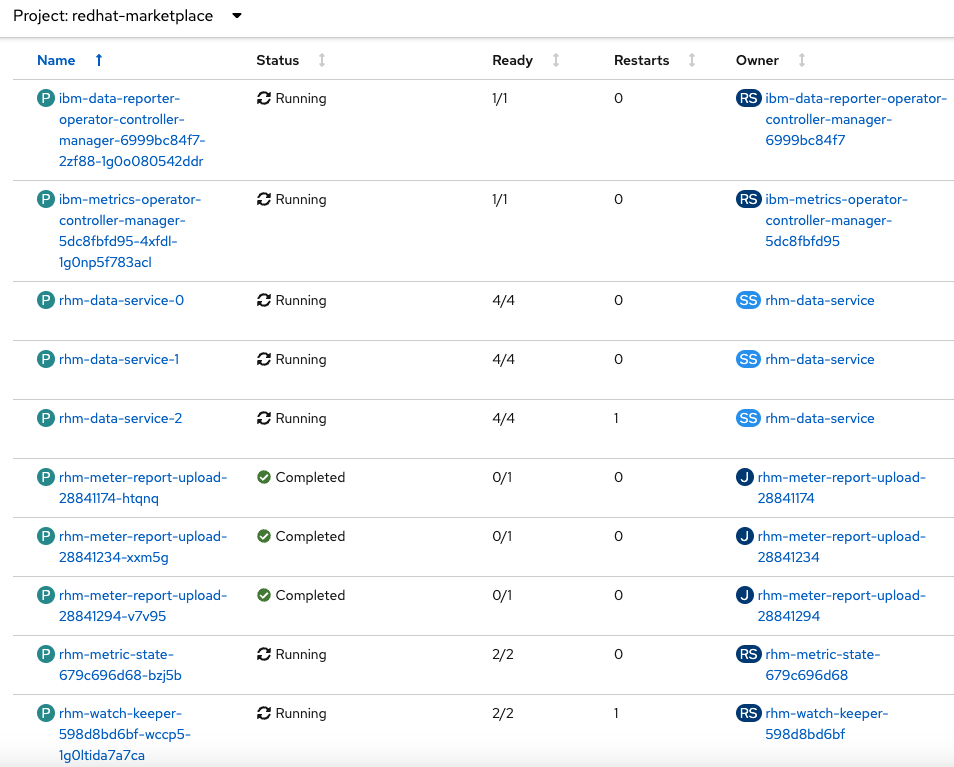

# Deploying IBM Maximo Visual Inspection (MVI)

IBM Maximo Visual Inspection (MVI) is one of the Maximo Application Suite (MAS) applications, with intuitive user interface for labelling, training, and deploying artificial intelligence vision models. By using deep learning AI, MVI can identify production defects and monitor assets for potential disruptions.

- Image classification - Train a model to recognize and classify objects in images. Results are classified by analyzing how the visual content relates to nearby pixels.
- Object detection - Train a model to detect and tag objects in images or videos. Results appear with rectangular or polygonal bounding boxes.
- Action detection - Train a model to detect and tag actions in videos. Actions of interest are located in both space and time.

Maximo Visual Inspection consists of hardware, resource management, deep learning computation, service management, and application service layers. More details on [MVI architecture](https://www.ibm.com/docs/en/mas-cd/maximo-vi/continuous-delivery?topic=overview).

## MVI Prerequisites

- IBM entitlement key. More details on [Obtaining your entitlement key](https://www.ibm.com/docs/en/cloud-paks/1.0?topic=entitlements-obtaining-your-red-hat-entitlement-key)
- MAS license. More details on [MAS licensing review](https://www.ibm.com/products/maximo/pricing)
- GPUs. MVI requires graphical processing units (GPUs) to conduct deep learning model training.

Also, MAS core must be installed prior to MVI deployment. 

## MVI Deployment Options

You can install Maximo Visual Inspection using one of the deployment options:

- CLI, "mas install" in a local container
- Ansible playbooks
- MAS admin console 

Maximo Visual Inspection can be deployed on-prem or in the cloud, IBM Cloud, [Microsoft Azure](https://www.ibm.com/docs/en/mas-cd/maximo-vi/continuous-delivery?topic=overview-deploying-azure) or [Amazon AWS](https://www.ibm.com/docs/en/mas-cd/continuous-delivery?topic=inspection-adding-gpu-worker-node).

## Deploying MVI through CLI (mas install)

You can run the cli command line in a local docker or podman container. It is suggested that you keep the IBM entitlement key and license key file in a local folder e.g. masconfig and map it with the same name in the container. These files are now visible in the container if you run `ls -lart /masconfig`.

```
#using podman. You will need to create a virtual environment on mac.
#podman machine init
#podman machine start

cd masconfig
podman run -ti --rm --pull always -v ${PWD}:/masconfig quay.io/ibmmas/cli

#podman machine stop

oc login --token=sha256~NmRKXgJSOxMGkITUx6Aw0IFPY2rx... --server=https://xxx.com:32250

mas install
```

Follow the prompts in the terminal session and select the y/n option or specify values.

- storage class: go with the default or specify one that supports "rwo" and "rwx" if necessary
- specify namespace for IBM Data Reporter Operator (DRO) (formerly UDS). The default is "Redhat-Marketplace", but you can change it to "ibm-dro" or other names.

Below is the summary of the deployment settings. You can check the deployment process from the OpenShift admin console. The deployment can take one hour or longer.

```
23) Review Settings
Connected to:
 - https://console-openshift-console.xxx.com

23.1) OpenShift Container Platform
  Storage Class Provider .................. ocs
  ReadWriteOnce Storage Class ............. ocs-storagecluster-ceph-rbd
  ReadWriteMany Storage Class ............. ocs-storagecluster-cephfs
  Certificate Manager ..................... redhat
  Cluster Ingress Certificate Secret ...... Default
  Single Node OpenShift ................... No
  Skip Pre-Install Healthcheck ............ No
  Skip Grafana-Install .................... No

23.2) IBM Container Registry Credentials
  IBM Entitlement Key ..................... /masconfig/entitlement.dat

23.3) IBM Data Reporter Operator (DRO) Configuration
  Contact e-mail .......................... xxx@xxx.com
  First name .............................. firstname
  Last name ............................... lastname
  Install Namespace ....................... ibm-operators

23.4) IBM Suite License Service
  License File ............................ /masconfig/license.dat
  IBM Open Registry ....................... icr.io/cpopen

23.5) IBM Maximo Application Suite
  Instance ID ............................. inst1
  Workspace ID ............................ masdev
  Workspace Name .......................... masdev

  Operational Mode ........................ Non-Production
  Install Mode ............................ Connected Install

  Manual Certificates ..................... Not Configured

  Enable Guided Tour ...................... false

  Catalog Version ......................... v9-240827-amd64
  Subscription Channel .................... 9.0.x

  IBM Entitled Registry ................... cp.icr.io/cp
  IBM Open Registry ....................... icr.io/cpopen

  Trust Default Cert Authorities .......... true

  Additional Config ....................... Not Configured
  Pod Templates ........................... Not Configured

23.6) IBM Maximo Application Suite Applications
  IoT ..................................... Do Not Install
  Monitor ................................. Do Not Install
  Manage .................................. Do Not Install
  Loc Srv Esri (arcgis) ................... Do Not Install
  Predict ................................. Do Not Install
  Optimizer ............................... Do Not Install
  Assist .................................. Do Not Install
  Visual Inspection ....................... 9.0.x
   + Storage Class ........................ ocs-storagecluster-cephfs
  AI Broker ............................... Do Not Install

23.7) MongoDb
  Install Namespace ....................... mongoce

23.8) Cloud Object Storage
  Type .................................... None

23.9) Grafana
  Install Grafana ......................... Install

23.10) Turbonomic
  Turbonomic Integration .................. Disabled

Please carefully review your choices above, correcting mistakes now is much easier than after the install has begun
Proceed with these settings? [y/n] y

24) Launch Install
If you are using storage classes that utilize 'WaitForFirstConsumer' binding mode choose 'No' at the prompt below
Wait for PVCs to bind? [y/n] n
✅️ OpenShift Pipelines Operator is installed and ready to use
✅️ Namespace is ready (mas-inst1-pipelines)
✅️ MAS CLI image deployment test completed
✅️ Latest Tekton definitions are installed (v11.6.0)
✅️ PipelineRun for inst1 install submitted

View progress:
  https://console-openshift-console.xxx.com/k8s/ns/mas-inst1-pipelines/tekton.dev~v1beta1~PipelineRun/inst1-install-241102-1659

```

## Deploying MVI using Ansible Playbooks

Follow the steps outlined in the document, [Install Visual Inspection Application](https://ibm-mas.github.io/ansible-devops/playbooks/oneclick-visualinspection). If cloud object storage (cos) is used, specify storage class in the corresponding environment variables.

```
export MAS_INSTANCE_ID=inst1
export MAS_CONFIG_DIR=/masconfig
export IBM_ENTITLEMENT_KEY=/masconfig/entitlement.dat
export SLS_LICENSE_ID=46bb6b6d8791
export SLS_LICENSE_FILE=/masconfig/license.dat
export DRO_CONTACT_EMAIL=xxx@xxx.com
export DRO_CONTACT_FIRSTNAME=firstname
export DRO_CONTACT_LASTNAME=lastname

# storage class
export PROMETHEUS_ALERTMGR_STORAGE_CLASS=ocs-storagecluster-cephfs
export PROMETHEUS_STORAGE_CLASS=ocs-storagecluster-cephfs
export PROMETHEUS_USERWORKLOAD_STORAGE_CLASS=ocs-storagecluster-cephfs
export GRAFANA_INSTANCE_STORAGE_CLASS=ocs-storagecluster-cephfs
export MONGODB_STORAGE_CLASS=ocs-storagecluster-cephfs
export DRO_STORAGE_CLASS=ocs-storagecluster-cephfs

#Optionally, specify data report operator (dro) namespace
export DRO_NAMESPACE=ibm-dro

oc login --token=xxxx --server=https://myocpserver
ansible-playbook ibm.mas_devops.oneclick_add_visualinspection

```

This playbook deployment option installs gpu operators automatically. It takes approximately one hour or longer.

```
    # Install Nvidia Operator (~15 Minutes)
    - ibm.mas_devops.nvidia_gpu
    # Apply MAS configurations related to Object Storage (~5 Minutes)
    - ibm.mas_devops.suite_config
    # Deploy Visual Inspection (~15 Minutes)
    - name: ibm.mas_devops.suite_app_install
    # Activate Visual Inspection in workspace (~15 Minutes)
    - ibm.mas_devops.suite_app_config
```

With this deployment option, you can further automate the process by creating Tekton pipelines, pipelineruns and tasks. For more details, check [Tasks and Pipelines](https://tekton.dev/docs/pipelines/).

## Deploying MVI through MAS admin console

This deployment option involves the following steps. Fore more details, check ["Deploying IBM® Maximo Visual Inspection"](
https://www.ibm.com/docs/en/mas-cd/continuous-delivery?topic=a-maximo-visual-inspection)

- Enabling GPU passthrough
- Installing the NVIDIA operator
- Adding a GPU worker node to a Red Hat OpenShift cluster on AWS (Optional)
- Creating and applying YAML files
- Completing the deployment from the MAS admin console

## Check MVI deployment status and pods

The CLI deployment involves running Tekton pipelines in OpenShift. Navigate to the Pipelines section in OpenShift. Select "mas install" pipeline. From the PipelineRuns tab select the pipelinerun instance, e.g. "inst1-install-xxx". You can see the task running status in the pipelinerun. The green color check mark indicates success and the red color check mark indicates failure.



Also, you can check pods in the dro project", the gpu project, the MVI project.

```
[ibmmas/cli:11.6.0]mascli$ oc get pods -n "ibm-operators"
NAME                                                            READY   STATUS      RESTARTS   AGE
ibm-data-reporter-operator-controller-manager-89f59996b-ggmkx   1/1     Running     0          3d2h
ibm-metrics-operator-controller-manager-7d99dd996c-hcccv        1/1     Running     0          3d2h
rhm-data-service-0                                              4/4     Running     0          3d2h
rhm-data-service-1                                              4/4     Running     0          3d2h
rhm-data-service-2                                              4/4     Running     0          3d1h
rhm-meter-report-upload-28846993-ttzr5                          0/1     Completed   0          169m
rhm-meter-report-upload-28847053-f7c7k                          0/1     Completed   0          109m
rhm-meter-report-upload-28847113-v848z                          0/1     Completed   0          49m
rhm-metric-state-679c696d68-8kg67                               2/2     Running     0          3d2h

[ibmmas/cli:11.6.0]mascli$ oc get pods -n "nvidia-gpu-operator"
NAME                                       READY   STATUS      RESTARTS   AGE
gpu-feature-discovery-j22sw                1/1     Running     0          3d1h
gpu-operator-694f78dd7b-9pt6t              1/1     Running     0          3d2h
nvidia-container-toolkit-daemonset-zr2qq   1/1     Running     0          3d1h
nvidia-cuda-validator-hrf8h                0/1     Completed   0          3d1h
nvidia-dcgm-exporter-sjmbq                 1/1     Running     0          3d1h
nvidia-dcgm-n66d7                          1/1     Running     0          3d1h
nvidia-device-plugin-daemonset-h5pkd       1/1     Running     0          3d1h
nvidia-device-plugin-validator-6q84k       0/1     Completed   0          3d1h
nvidia-driver-daemonset-lmbnt              1/1     Running     0          3d1h
nvidia-node-status-exporter-vvkt7          1/1     Running     0          3d1h
nvidia-operator-validator-8bhr9            1/1     Running     0          3d1h

[ibmmas/cli:11.6.0]mascli$ oc get pods -n "mas-inst1-visualinspection"
NAME                                                 READY   STATUS      RESTARTS   AGE
ibm-mas-visualinspection-operator-574b9b7dd7-8qtq8   1/1     Running     0          23h
inst1-dataset-feature-785dd59c94-mb4vr               1/1     Running     0          3d
inst1-dataset-summarization-786dd766c5-ftw7m         1/1     Running     0          3d
inst1-dlm-policy-cc7694767-4vd26                     1/1     Running     0          3d
inst1-edgeman-676cfc9c64-42bt6                       1/1     Running     0          3d
inst1-model-conversion-5759799f9b-j2wtw              1/1     Running     0          3d
inst1-service-586767955f-ffbl8                       1/1     Running     0          3d
inst1-service-dataset-7cdc46dbbd-ww2q7               1/1     Running     0          3d
inst1-task-pvc                                       0/1     Completed   0          3d
inst1-taskanaly-649544d7cc-8c5dz                     1/1     Running     0          3d
inst1-ui-f5c656cf-hmtrc                              1/1     Running     0          3d
inst1-usage-hourly-28847100-pks6v                    0/1     Completed   0          34m
inst1-useragent-599fc95c9-7qx97                      1/1     Running     0          3d
inst1-video-microservice-9bc9788f5-6gsw6             1/1     Running     0          3d
```

## Get Started with MVI

Locate the MVI url in the networking routes in the MVI project from the OpenShift console or the command line `oc get routes -n <mvi project>`. 
It looks like `https://masdev.visualinspection.inst1.xxx.com/`. Log in to MVI with your MAS user account.



For more details on how to use Maximo Visual Inspection, check [Configuring MVI](https://www.ibm.com/docs/en/mas-cd/maximo-vi/continuous-delivery?topic=configuring).

## Install Maximo Visual Inspection Edge (MVIE)

IBM Maximo Visual Inspection Edge (MVIE) is a web-based application that uses trained models and data sets from IBM Maximo Visual Inspection (MVI) to perform AI-based inspections at the edge.

To understand how MVIE works with MVI, check [How Maximo Visual Inspection Edge and Maximo Visual Inspection interact](https://www.ibm.com/docs/en/mas-cd/maximo-vi/continuous-delivery?topic=overview-interaction-maximo-visual-inspection)

For MVIE configuration in MVI,, check "Deploying IBM Maximo Visual Inspection Edge"(https://www.ibm.com/docs/en/mas-cd/continuous-delivery?topic=ons-maximo-visual-inspection-edge)

For MVIE deployment, check [Installing and uninstalling MVIE](https://www.ibm.com/docs/en/mas-cd/maximo-vi/continuous-delivery?topic=SSRU69_cd/base/vision_edge_install.htm)

## Integrating with IBM Maximo Visual Inspection Mobile

IBM Maximo Visual Inspection Mobile is an iOS or iPadOS mobile application that brings the capabilities of IBM Maximo Visual Inspection to the edge and rapidly enables visual inspections on mounted or handheld devices.

IBM Maximo Visual Inspection Mobile uses the models that are trained on IBM Maximo Visual Inspection and does the inferencing by using the integrated camera on an iOS or iPadOS device. The app can run models remotely or can use Core ML models that are exported from IBM Maximo Visual Inspection, which enables local inferencing on-device without requiring network connectivity.

For more details on MVI Mobile, check [Integrating with IBM Maximo Visual Inspection Mobile](https://www.ibm.com/docs/en/mas-cd/maximo-vi/continuous-delivery?topic=integrating-maximo-visual-inspection-mobile)

## MVI Capacity Planning

https://www.ibm.com/docs/en/mas-cd/maximo-vi/continuous-delivery?topic=edge-planning

### Worker Node with GPU:
    • CPU: A minimum of 8 cores is typical, but 16–32 cores can enhance training speeds.
    • Memory: 64 GB is a standard minimum; 128 GB is preferable for larger datasets.
    • Local Storage: Aim for high-speed SSD storage, with 500 GB to 1 TB, depending on dataset size. If the dataset size is over 100 GB, storage requirements will increase substantially due to preprocessing and model checkpoints.
    • Dataset Size: GPU memory on the L40S will likely support datasets from hundreds of megabytes to several gigabytes directly. Larger datasets (over 10 GB) benefit from data streaming or partitioning.

### General Worker Nodes:
    • CPU: 4–8 cores for non-GPU nodes.
    • Memory: 32–64 GB, depending on workload and dataset size.
    • Storage: SSD with 200–500 GB, for cache and intermediate files.

### Edge Instance Support and Concurrent Users:

- MVI Edge Instances: The exact number of Edge instances depends on the distribution of computational load across them. A single GPU L40S should handle 1–3 instances comfortably if usage is sequential or moderately concurrent. Scaling beyond that may impact real-time processing speeds and throughput.
- Concurrent Users: For inferencing, each inference pod should handle about 5–10 concurrent requests comfortably, depending on model complexity and latency requirements. To support 50 concurrent users, for instance, deploying 5–10 inference pods can distribute the load efficiently.

## Troubleshooting MVI deployment

To resolve deployment issues, check OpenShift pods, pod logs, etc.

### Nvidia GPU L40S driver issue

One possible issue is that an outdated Nvidia driver is used, causing Nvidia GPU daemonset in ImagePullBackoff error, as shown below.



Resolution: check the worker node Red Hat RHEL version, find the correct driver version and apply it to the custom resource for MVI. For more details, check [NVIDIA GPU cluster policy stuck in Not Ready state](https://www.ibm.com/support/pages/node/7112272) and [NVIDIA GPU Driver](https://catalog.ngc.nvidia.com/orgs/nvidia/containers/driver/tags)

- Check the worker node Red Hat RHEL version

```
cat /etc/redhat-release
# Red Hat Enterprise Linux release 8.10 (Ootpa)
```

- Find the correct driver version

Go to https://catalog.ngc.nvidia.com/orgs/nvidia/containers/driver/tags. For example, 550.90.07-rhel8.10 was released on 06/12/2024 3:49 PM. Note that new versions will be released, for example, 565.57.01-rhel8.10 was released on 10/30/2024 9:49 PM.

- Update GPU cluster policy. 

Go to CRD filter for nvidia cluster policy, access the gpu-cluster-policy instance and change the version under the driver spec.
```
  driver:
    enabled: true
    image: driver
    imagePullSecrets: []
    licensingConfig:
      configMapName: ''
      nlsEnabled: false
    repository: nvcr.io/nvidia
version: 550.90.07
```

- Delete GPU pods in error. Check any pod errors.

### DRO errors

While the IBM Data Report Operator is installed successfully, you may notice that only two pods, the data reporter operator pod and metrics operator controller manager pod, are running but none of the rhm-data-service pods and others are running, as shown in the screenshot.



One possible cause is that the DRO operator installed in the default namespace, redhat-marketplace, resulted in some unknown issue, which will be investigated by the product group. The resolution is to install the DRO operator in a different namespace, e.g. "ibm-dro", or "ibm-operators".

- Delete ibm-operator-catalog from catalog source in CRD. This is an optional step if you want to use a latest catalog version, e.g. "v9-241003-amd64".
- Remove/uninstall installed DRO operator
- Delete projects mongoce, grafana and ibm-sls
- Re-run "mas install" cli command line or the ansible playbook for MVI
- Specify "ibm-operators" for DRO namespace (instead of "redhat-marketplace"). You can also specify it as "ibm-dro".

More info on [DRO](https://ibm-mas.github.io/ansible-devops/roles/dro/). 

## Acknowledgement

Many thanks to my IBMers 
Anil Deshpande, 
BALAJI SANTHANAKRISHNAN, 
DAVID Boggs, 
David Stacy, 
Mike Hollinger, 
Tiffany Ly 
for their support and guidance as I developed and tested the automated MVI deployment process.


